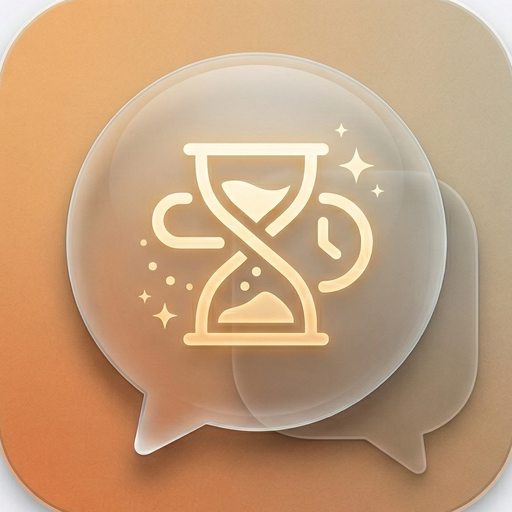

[English](./README.md) | [简体中文](./README.zh-CN.md)

<div align="center">



# Claude Session Hub

**原生 macOS 任务管理器，专为 Claude Code 会话设计。**

一眼掌控所有项目中的会话状态、健康信号和工作进度。

*享受 AI，也别忘了管好 AI。*

[](https://www.apple.com/macos/sonoma/)
[](https://swift.org)
[](.)
[](LICENSE)

</div>

---

## 它做什么

Claude Session Hub 读取本地 Claude Code 数据（`~/.claude/`），为你提供统一的仪表盘来管理所有项目中的会话。无 API 调用、无网络请求、完全离线。

**Sessions 视图** — 按项目浏览会话，三层 Tile 展示标题、任务摘要、健康信号和工程元信息。

**Overview 仪表盘** — 项目组合 + 注意力收件箱。一眼看出哪些会话需要关注、哪些正在活跃，一键导航到任何项目。

**健康信号** — 条件式告警，只在有问题时才显示，不打扰正常会话：
- 停滞会话（停止 2 天以上且未完成）
- 上下文接近满（超过模型上限的 75%）
- 近期错误（最近 20 轮中的错误）

## 功能特性

- **项目 → 会话层级** 带分区侧边栏（Agents / Projects / Status）
- **三层会话 Tile** 带条件式健康信号（每个 Tile 最多 2 个）
- **Overview 仪表盘** 含摘要卡片、项目热度条、注意力收件箱、项目组合
- **一键恢复** 在 Ghostty 或 Terminal.app 中打开，静默回退到剪贴板
- **手动标签** — 双击重命名任何会话
- **会话归档** — 隐藏已完成的会话，可切换显示
- **结构化事实提取** 从 Claude Code JSONL 中提取（不靠猜测）
- **完整上下文计量** — `input_tokens + cache_creation + cache_read`
- **Provider 抽象** — 首先支持 Claude Code，Codex 接口已预留
- **键盘快捷键** — Cmd+F（搜索）、Cmd+,（设置）、Esc（清除）

## 快速开始

### 下载

从 [Releases](https://github.com/MedivhStory/ClaudeSessionHub/releases) 获取最新 `.zip`，解压后双击 `ClaudeSessionHub.app` 即可运行。

> 首次启动：macOS 可能会弹出 Gatekeeper 警告。右键点击应用，选择"打开"即可绕过。

### 从源码运行

```bash
git clone https://github.com/MedivhStory/ClaudeSessionHub.git
cd ClaudeSessionHub
swift run ClaudeSessionHub
```

### 在 Xcode 中运行

1. 用 Xcode 打开 `Package.swift`
2. 选择 **ClaudeSessionHub** scheme，目标选 **My Mac**
3. Cmd+R

### 构建独立 .app

```bash
xcodebuild -project ClaudeSessionHub.xcodeproj \
  -target ClaudeSessionHub \
  -configuration Release \
  build CONFIGURATION_BUILD_DIR=./dist

# 嵌入应用图标
mkdir -p dist/ClaudeSessionHub.app/Contents/Resources
cp Resources/AppIcon.icns dist/ClaudeSessionHub.app/Contents/Resources/
/usr/libexec/PlistBuddy -c "Add :CFBundleIconFile string AppIcon" \
  dist/ClaudeSessionHub.app/Contents/Info.plist 2>/dev/null

open dist/ClaudeSessionHub.app
```

## 测试

```bash
# 单元测试（55 条）
swift test

# UI 测试（15 条，需要 Xcode）
xcodebuild -project ClaudeSessionHub.xcodeproj \
  -scheme ClaudeSessionHub \
  -destination 'platform=macOS' \
  test -only-testing:'ClaudeSessionHubUITests'
```

UI 测试使用确定性 fixture 模式（`--ui-test-mode`），内含 4 条模拟会话 — 无需真实 `~/.claude/` 数据。

## 架构

```
┌─────────────────────────────────────┐
│  SessionStore (@Observable)         │  SwiftUI 绑定层
├─────────────────────────────────────┤
│  ScanCoordinator                    │  并发运行所有 Provider
├─────────────────────────────────────┤
│  规范模型层                          │  SessionSummary, SessionDetail,
│                                     │  HealthSignal, ResumeTarget
├─────────────────────────────────────┤
│  AgentProvider（协议）               │  ClaudeProvider, CodexProvider (stub)
│  读取 ~/.claude/ JSONL              │  只输出规范类型
└─────────────────────────────────────┘
```

**数据源**（只读，从不修改）：

| 数据源 | 路径 | 用途 |
|---|---|---|
| 会话 JSONL | `~/.claude/projects/<key>/<id>.jsonl` | 会话内容 |
| 进程元数据 | `~/.claude/sessions/<pid>.json` | PID 存活检测 |
| 历史索引 | `~/.claude/history.jsonl` | 快速会话查找 |

**应用设置** 存储在 `~/.claude-hub/`（标签、归档状态、偏好）。

## 系统要求

- **macOS 14**（Sonoma）或更高版本
- **Swift 5.9+**
- **Xcode 26+**（用于构建 .app 和运行 UI 测试）
- 已安装 Claude Code（应用读取其本地数据）

## 当前限制

- Codex provider 仍为 stub（协议已就绪，尚无实现）
- 修改数据目录需要重启应用
- 无代码签名或公证
- `recentErrorCount` 使用尾部 50 条近似，非精确最近 20 轮

## 许可

MIT

---

<div align="center">

*享受 AI，也别忘了管好 AI。*

基于 SwiftUI 构建。为 Claude Code 重度用户设计。

</div>
